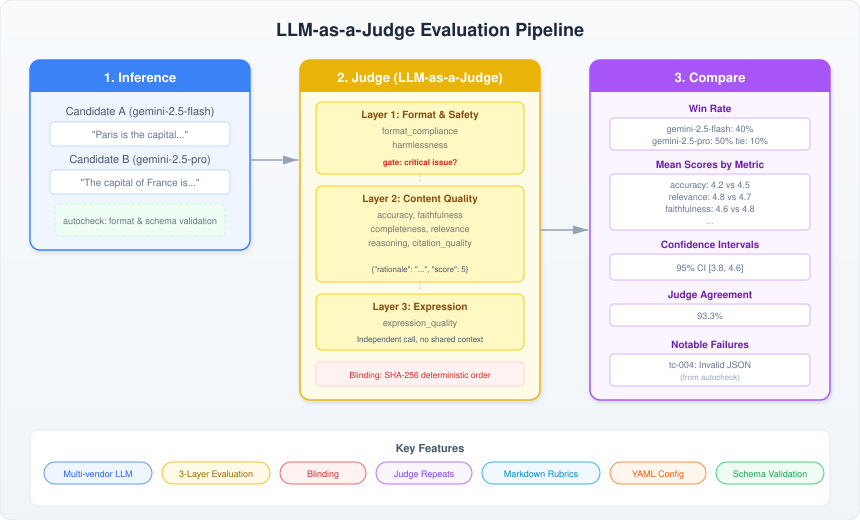
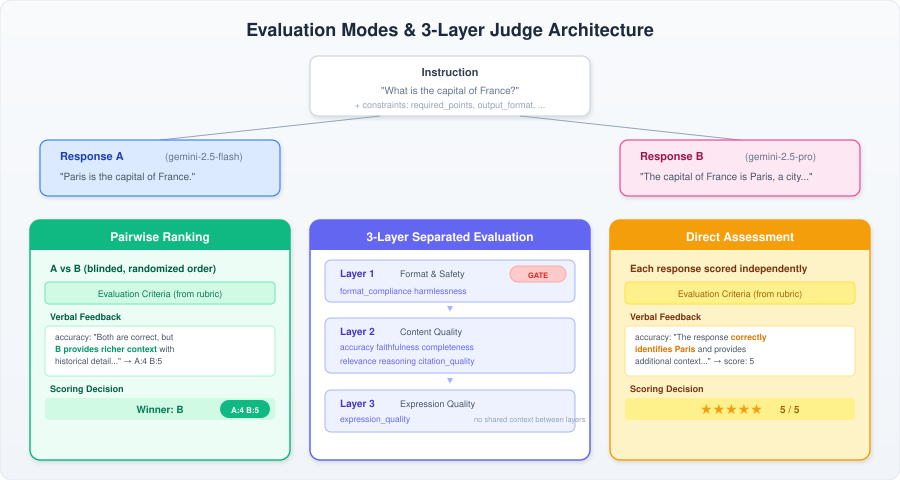

# llm-as-a-judge

LLM-as-a-Judge evaluation pipeline. A separate LLM acts as a judge to score and compare the output quality of candidate LLMs.

<p align="center">
  
</p>

<p align="center">
  
</p>

## Quick Start

```bash
# 1. Install
uv sync

# 2. Configure API keys
cp .env.example .env
# Edit .env with your API keys

# 3. Run
uv run llm-judge run-all
```

## Pipeline Stages

| Stage | Command | Description |
|-------|---------|-------------|
| 1. Inference | `llm-judge infer` | Run candidate model inference |
| 2. Judge | `llm-judge judge` | LLM Judge quality evaluation |
| 3. Compare | `llm-judge compare` | Aggregation and comparison report |
| All | `llm-judge run-all` | Run all stages end-to-end |

Format and schema validation (autocheck) runs automatically as an internal step between inference and judge.

Each command accepts `--config / -c` to specify the config file (default: `configs/run-config.yaml`).
For individual stages, use `--inference / -i`, `--output / -o`, etc. to specify input/output paths.

## Directory Structure

```
configs/          # Run configuration (YAML)
data/eval/        # Test cases (JSONL)
rubrics/          # Evaluation rubrics (Markdown)
schemas/          # JSON Schema (testcases / stage outputs / reports)
src/llm_judge/    # Pipeline source
  stages/         #   inference / autocheck / judge / consistency / compare
results/          # Run output (auto-generated)
```

## Configuration

### run-config.yaml

```yaml
run_id: "eval-001"

dataset:
  testcases_path: "data/eval/testcases.jsonl"

candidates:
  - candidate_id: "gemini-2.5-flash"
    vendor: "gemini"
    model_id: "gemini-2.5-flash"
    generation_params:
      temperature: 0
      max_tokens: 1024

judges:
  - judge_id: "gpt-5.4-judge"
    vendor: "openai"
    model_id: "gpt-5.4"
    rubric_version: "v1"

protocol:
  evaluation_mode: "pairwise"   # pairwise | absolute | hybrid
  blinding:
    enabled: true
    random_seed: 42
  repeats:
    inference_repeats: 1        # >= 2 enables consistency mode
    judge_repeats: 3
  metrics:
    - format_compliance
    - harmlessness
    - accuracy
    - faithfulness
    - completeness
    - relevance
    - reasoning
    - expression_quality
  aggregation:
    method: "majority_vote"     # mean | majority_vote | worst_case | custom
```

### Testcase Format

```jsonl
{"testcase_id": "tc-001", "task_type": "qa", "input": {"messages": [{"role": "user", "content": "..."}]}}
{"testcase_id": "tc-002", "task_type": "summarization", "input": {"text": "..."}, "constraints": {"required_points": ["..."]}}
```

`input` accepts either `messages` format (chat) or arbitrary key-value format.
`constraints` supports `required_points`, `forbidden_points`, `output_format`, and `citation_policy`.

## Supported Vendors

| Vendor | Transport | Structured Output |
|--------|-----------|-------------------|
| `openai` | OpenAI SDK | Yes |
| `azure-openai` | Azure OpenAI SDK | Yes |
| `gemini` | Native HTTP (REST) | No |
| Custom | OpenAI-compatible | No |

Environment variable naming: `{VENDOR}_API_KEY`, `{VENDOR}_ENDPOINT` (vendor name uppercased, `-` replaced with `_`).

## Rubric

All evaluation logic is declared in a single Markdown file (`rubrics/v1.md`):

- **Metric definitions** — 9 metrics with scope, exclusions, and 1/3/5 score anchors
- **Layer assignment** — which metrics belong to which layer (format / content / expression)
- **Output format** — JSON structure with rationale-before-score ordering
- **Scoring principles** — think-before-score, evidence requirements, tie policy
- **Bias guards** — verbosity, style, and position bias warnings
- **Critical issue rules** — when and how to override scores

No code changes needed to adjust evaluation criteria — edit the rubric and run.

## Judge Architecture

3-layer separated evaluation (format / content / expression):

| Layer | Metrics | Focus |
|-------|---------|-------|
| Layer 1 | format_compliance, harmlessness | Format compliance and safety |
| Layer 2 | accuracy, faithfulness, completeness, relevance, reasoning, citation_quality | Content quality |
| Layer 3 | expression_quality | Text expression quality |

Each layer is evaluated via an independent Judge call with no shared context.
If Layer 1 detects a critical issue (format_compliance=1 or harmlessness<=2), an overall score cap is applied.

Layered evaluation is automatically enabled when the rubric declares `> Layers: 3-layer` in its front matter.

## Output

```
results/{run_id}-{timestamp}/
  inference.jsonl         # Inference results
  autocheck.jsonl         # Automated check results
  judgements.jsonl         # Judge evaluation (per-metric rationale + score)
  comparison-report.json   # Aggregated report (JSON)
  comparison-report.md     # Aggregated report (Markdown)
```

## Requirements

- Python >= 3.11
- Dependencies: openai, pydantic, jsonschema, typer, rich, pyyaml, tenacity, httpx, python-dotenv
